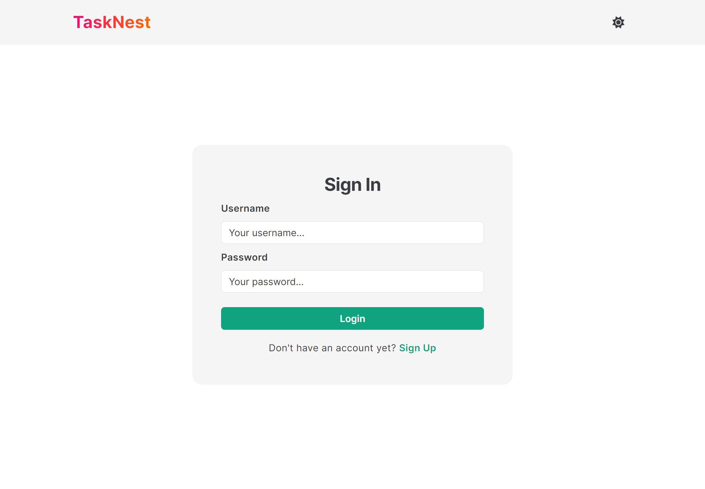
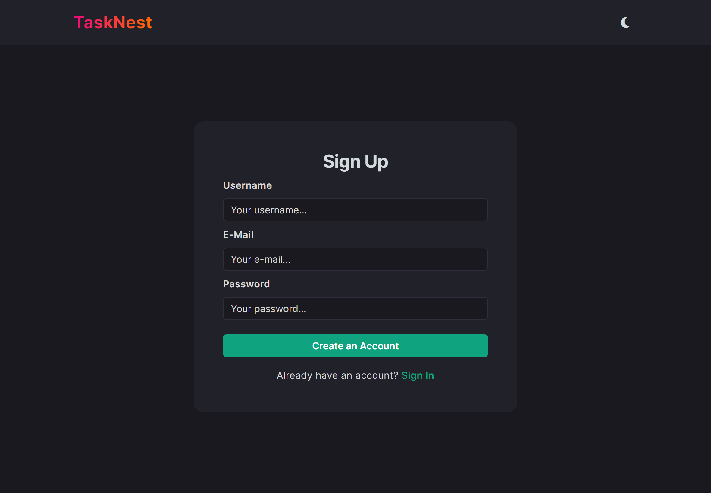
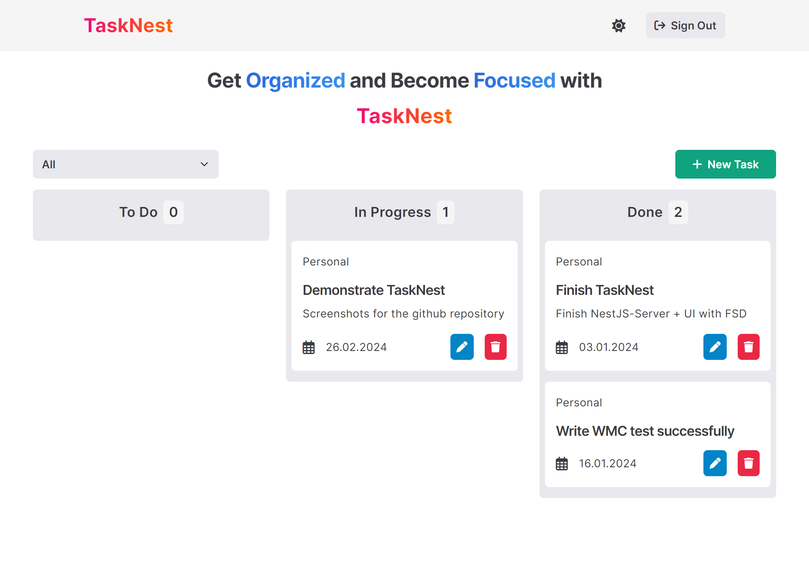
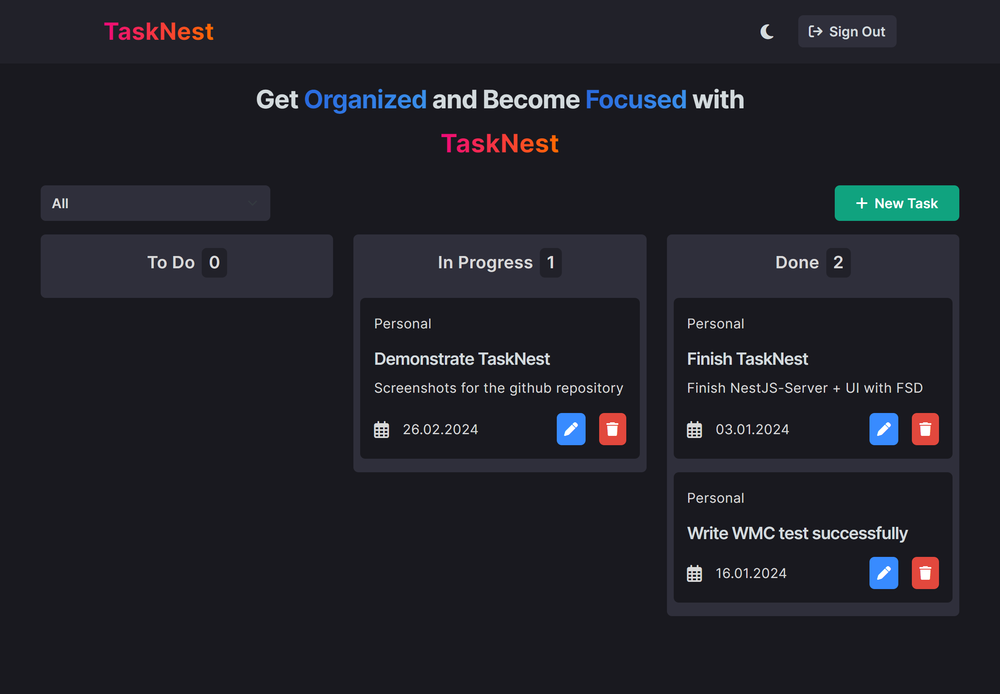
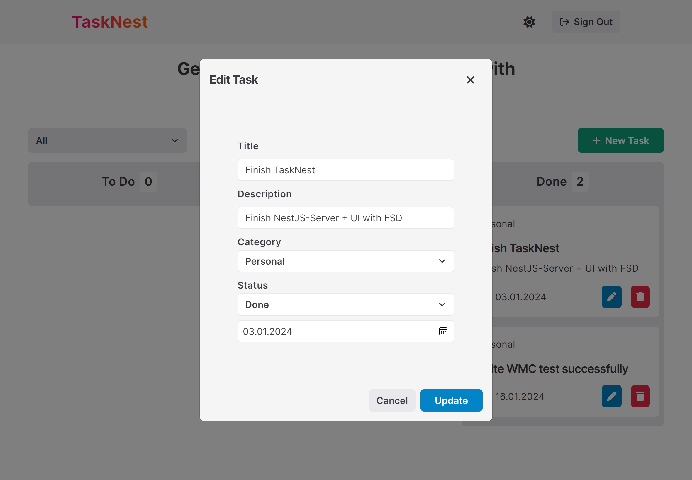

# TaskNest - Task Management System

TaskNest is a simple and user-friendly Task Management System developed with NestJS for the backend and React JS with 🍰 [FSD (Feature-Sliced Design)](https://feature-sliced.design/) architecture for the frontend. The primary goal of this project is to learn NestJS and FSD.

## ⚙️Tech Stack

### Backend

-   `NestJS` as a framework for building server-side application
-   `MongoDB` for storing and managing data

### Frontend

-   `React JS` for building UI
-   `Bootstrap 5` for responsive design
-   `FSD (Feature-Sliced Design)` as frontend architecture

### Authentication:

-   `JWT (JSON Web Tokens)` as a method for user authentication

## 🌟Key Features

-   `User Authentication and Authorization`

    -   Registration with activation link per e-mail
    -   Login functionality

-   `Task Management`

    -   Allows users to create, read, update, and delete tasks
        -   Each task includes details like title, description, due date, category and status
    -   Categorization of tasks into different categories (work, personal, study)

-   `Filter functionality`
    -   Allows users to filter tasks by category.

## 📸 Screenshots

-   `Sign In Screen (Light Mode)`

-   `Sign Up Screen (Dark Mode)`

-   `Main Page (Light Mode)`

-   `Main Page (Dark Mode)`

-   `Edit Task`

